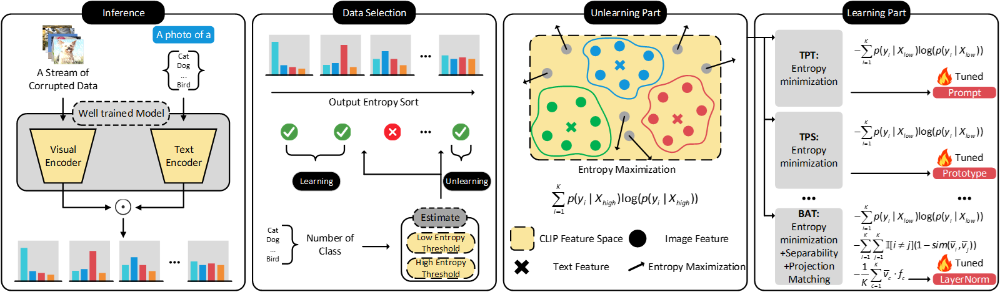

# Bilateral Information-aware Test-time Adaptation for Vision-Language Models

## Overview
This repository contains the official implementation of BITTA for image classification with a pre-trained CLIP.

## Prerequisites

### Hardware

This implementation is for the single-GPU configuration. 

To evaluate on ImageNet-C (which has 1000 classes), you will need a GPU with more than (not including) 24GB memory. This codebase is tested on a GPU with 32GB memory.
To evaluate other datasets (with less than a few hundred classes), a GPU with 16GB memory will work fine. 

### Environment 
The code is tested on PyTorch 1.7.1.

### Datasets 
Supported datasets:

[CIFAR-10-C](https://zenodo.org/record/2535967#.ZBiI7NDMKUk)
[CIFAR-100-C](https://zenodo.org/record/3555552#.ZBiJA9DMKUk)
[ImageNet-C](https://zenodo.org/record/2235448#.Yj2RO_co_mF)

Download all datasets and put them under `./dataset`. The overall file structure is as follows:
```
BITTA
|-- dataset
    |-- CIFAR-10-C
        |-- gaussian_noise.npy
        |-- shot_noise.npy
        ...
    |-- CIFAR-100-C
    |-- imagenet-c
```

## Run BITTA

We provide bash scripts in `tta.sh`.

An example to run BITTA :
```
bash tta.sh.
```

## Citation
```bib
@inproceedings{
sun2026bilateral,
title={Bilateral Information-aware Test-time Adaptation for Vision-Language Models},
author={Jingwei Sun and Jianing Zhu and Jiangchao Yao and Gang Niu and Masashi Sugiyama and Bo Han},
booktitle={The Fourteenth International Conference on Learning Representations},
year={2026},
url={https://openreview.net/forum?id=vv8EcCoBfr}
}
```

## Acknowledgements
We thank the authors of [TPT](https://github.com/azshue/TPT) and [BAT](https://github.com/sarthaxxxxx/BATCLIP) for their open-source implementation and instructions on data preparation.
